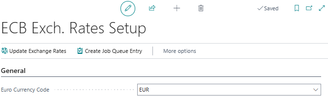
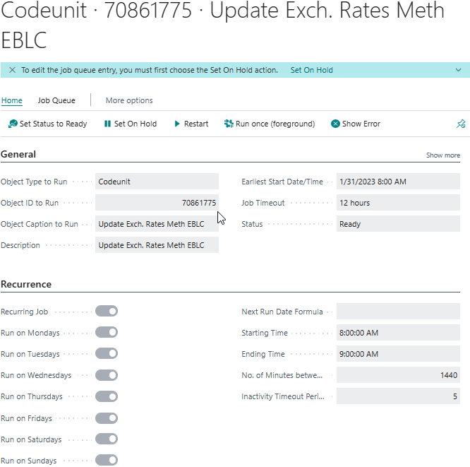

# Manual ECB Exchange Rate Converter

The ECB Exchange Rate Service supported by Business Central in the EURO region import the currencies quoted against the euro (base currency). This service doesn’t support Business Central companies with another base currency for example US dollar.

The ECB Exchange Rate Converter app supports the conversion of all the foreign exchange rates published by the ECB and updates the Currencies in Business Central on a daily basis based on the job queue entries setting for the service.

## Create a job queue entry for ECB Exchange Rate Converter
The following procedure shows how to create and setup the app to automatically retrieve and convert the published ECB foreign exchange rates to the currencies.
1.	Choose the Search icon, enter ECB Exch. Rates Setup, and the choose the related link.
2.	Fill the field Euro Currency Code with the Currency Code that is setup for the Euro currency. This field is mandatory during calculating the exchange rates.

3.	Choose the action Create Job Queue Entry. This action will create a Job Queue Entry and open it.

4.	Select the Run on checkboxes for all weekdays in tab Recurrence.
5.	In the Next Run Date Formula field, enter 1D.
6.	In the Starting Time field, enter 8 AM.
7.	In the Ending Time field, enter 9 AM.
8.	Choose the Set Status to Ready action.

Now the batch is ready to collect and convert the exchange rates every weekday at 8 AM. For manual processing, the action Update Exchange Rates on the ECB Exch. Rates Setup page can be used.
 
[:arrow_left:](../README.md) [Back](../README.md)